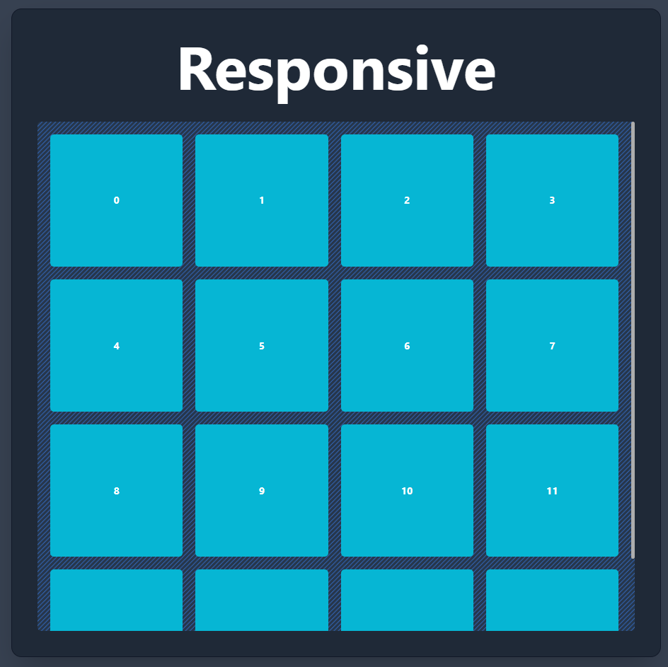

# Tailwind presentation

Instead of using boring PowerPoint for sutaining my Tailwind presentation (Learning and Development event at work), I decided to use a web app built with Tailwind to drive the point home.

It is just a small simple app that with a few pages that show the basiscs of tailwind, but it is a testament to what's possible with a nice web abb shell and 3-4 hours of work.

### `yarn` to install dependencies
### `yarn start` to serve the app locally

### `yarn build` to build the app

### `yarn preview` to serve the built app

# Here you can find a few screenshots of the presentation/app :

